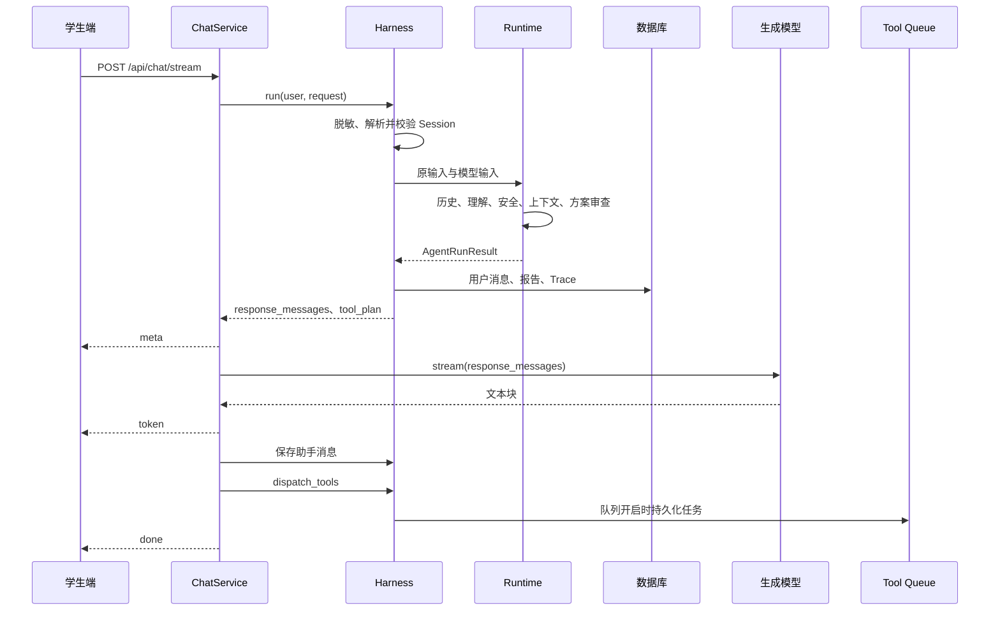

# 秋招版本

这是一份围绕**已经投递的简历版本**编写的项目学习稿。前面解释 Blackboard 协作、Redis + MySQL 分层记忆、SKILL.md 领域策略及关联链路；最后单独讲简历投递后迁入的历史会话与评测。按“解决什么问题 → 输入输出 → 源码执行 → 例子 → 验证与边界”学习，不要求同时阅读另外几套稿子。

基准日期：2026-09-19。主项目为 `D:\Agent\MindCare\mindbridge-py`，基础 HEAD 为 `8127b6c`，包含原有未提交增强和本次增量迁移。文中不评价项目名称差异。简历 PDF 与外部《知识库秋招1.0.txt》均保持原样。

## 0. 先确定简历、原问答稿与这份材料的关系

### 已投递简历可以继续使用

当前简历的三个主要亮点有本地实现支撑，没有发现需要因为主体能力不成立而重写的重大问题。之前建议微调，是为了让一句话的适用范围更清楚，不表示项目无法支撑简历，也不要求更换已投递版本。适当概括技术工作是正常的；面试时把概括展开到真实实现即可。

| 简历主线（含义概括） | 当前能讲清的实现 | 追问时补一句边界 |
|---|---|---|
| Blackboard 事件协作与回复方案审查 | 任务认领、Artifact、候选关联、critique 修订和最终采纳 | 当前是进程内有界协作；Safety 检查生成前方案 |
| Redis + MySQL 分层记忆与 Agent/Session 隔离 | 业务历史缓存与回填、角色私有笔记、摘要与窗口 | MySQL 回填对应业务历史；私有笔记没有同等回填链路 |
| SKILL.md 动态加载领域策略 | 文件解析、规则选择、高风险优先、交接模板 | 动态组装 Prompt，不等于训练模型或完整规则发布平台 |

技术栈中的 LangGraph 在本地主项目仍有兼容实现，因此不是凭空出现的技术。讲主流程时说明“当前采用 Blackboard，保留 LangGraph/custom 兼容入口”即可。不能把作者包直接覆盖过来后，还假设所有本地能力和兼容入口都存在。

代码中有某项能力，和这项能力由谁完成，是两个问题。学习和复现也有价值，个人贡献应根据实际经历描述。这份材料帮助解释代码，不代替个人开发经历，也不添加使用人数、上线效果或没有测过的性能数字。

### 知识库 1.0 的判断与具体不足

只看其中 MindCare/MindBridge 的 34 道问答，主体质量较好，足以作为项目介绍和一至两层机制追问的底稿。它已经区分计划审查与正文审查、业务历史与私有记忆、字符压缩与 API 费用，也写到了缓存缺口、同 Session 并发及副作用幂等。不能把这些已经写对的边界再次列为原稿错误。

不足主要是下面几处。本次按要求只说明，不修改原 TXT。

| 原稿位置或主题 | 我的判断 | 学习时应补足的内容 |
|---|---|---|
| “Trace 和 Harness 如何支持排障与验证” | 有一处归属表述需要收窄 | 认领、修订、Skill、记忆和工具拒绝的验证由 Engineering Harness 与单元/E2E 测试共同覆盖，不能全部归到 Harness 一个执行器 |
| 同题中的 Trace 排障 | 正常可观察记录没有问题，异常边界不够完整 | Trace 在 Runtime 返回后落库；中途失败不保证已有完整 Trace，不是每一步实时持久化的恢复日志 |
| “用一条高风险请求怎样串起对话、报告、个案和预警” | 正常链路正确，故障追问还缺一层 | 当前先完成 SSE 生成，再派发工具；流式生成抛异常时报告可能已存在，工具任务却未入队。具体看第 12 节 |
| “SafetyAgent 如何审查回复生成方案” | 原稿已正确限定生成前审查 | 再说明检查目前是五组约束标记的字符串匹配，不是语义级证明；测试要同时看候选 ID 和 messages 的实际变化 |
| 评测、验证和项目效果 | 方法说明较完整，现场证据不足 | 能运行哪个测试、打开哪个结果、展示哪段 Trace；区分“我会这样测”和“我已经在这些条件下测过” |
| 个人贡献 | 不能由源码审查推定 | 依据自己的记录说明原作者基础、复现理解、修改内容、验证结果；不需要为了回答漂亮而补造经历 |
| 整体回答长度 | 更适合准备稿，直接逐字背会偏长 | 先用两三句说明目的和实现，追问时展开具体字段、失败例子或测试，不把所有限制塞进第一句话 |

原稿没有写这次才增加的评测，并不构成错误；它原本就对应已投递版本。后续功能可以作为“之后补充了……”讲出来，无须因此重写简历。原稿作为追问底稿基本够用，但“题目都读过”不等于已经能解释任意源码细节；第 14 节给出可操作的学习标准。

### 为什么保留当前代码，只迁入补充功能

作者更新值得吸收的是学生历史会话与评测工具。它与作者较早包的公共 Agent 文件一致，并非重新设计了一套更强的核心协作。当前本地主线在完整安全约束、critique 实际注入、未采纳方案兜底、HIGH 优先选择 Skill、队列执行授权等地方有自己的增强，整包替换反而会丢失这些差异。

本次迁入历史会话 API/界面与独立评测目录，适配现有结构；保留原 Agent Runtime、ChatService、安全、记忆、RAG、Skill 和工具治理核心文件。没有修改数据库模型，也没有新增项目依赖。原始作者包仍独立留存，可核对来源。

## 1. 先认识这个系统要交付什么

学生可能问普通问题，也可能表达压力或出现需要人工关注的风险。系统既要生成能继续交流的回复，也要把后台报告、个案和通知组织起来。因此一轮请求不是只有“一段模型回答”这一种产物。

| 产物 | 面向谁 | 解决什么问题 |
|---|---|---|
| SSE 回复正文 | 学生 | 持续显示回答，完成交流 |
| PsychologicalReport | 后台工作人员 | 保存本轮评估结果及来源信息 |
| AgentRunTrace | 开发者、后台 | 查看可观察的调度过程、产物和决策结果 |
| ToolJob 与执行记录 | 后台 Worker、管理端 | 把台账、个案与通知推进到具体执行状态 |
| RiskCase 与交接摘要 | 后台工作人员 | 把报告组织成可继续跟进的材料 |

这些产物相互关联，却不同时完成。学生看到了最后一个 token，不代表邮件已发送；队列任务成功，也不代表工作人员已阅读。先把这些完成条件分开，后面就不容易把“对话完成”说成“整个业务闭环完成”。

项目提供的是心理支持与人工跟进的技术原型。仓库中存在模型、风险规则和评测脚本，不等于已经证明真实场景下的专业处置效果。

## 2. 一条请求的主链路

先看一个简单例子：学生在现有会话里输入“最近考试压力大，晚上睡不好”。这只是说明程序如何流转的示例，不预设真实模型一定给出哪个标签。



源码入口依次是 [routes.py](D:/Agent/MindCare/mindbridge-py/app/api/routes.py)、[chat.py](D:/Agent/MindCare/mindbridge-py/app/services/chat.py)、[harness.py](D:/Agent/MindCare/mindbridge-py/app/agents/harness.py)、[factory.py](D:/Agent/MindCare/mindbridge-py/app/agents/factory.py)。

第一步由 HTTP 层完成认证与参数处理。继续已有会话时，Harness 同时按会话 public ID 和当前 user ID 查找，不能仅凭会话 ID 读取别人的上下文。

随后 Harness 保留原输入，并生成经过 `PrivacySanitizer` 处理的 `model_input`。Runtime 接收这两个字段，读取此前的会话历史并执行协作。当前用户消息此时还没有保存，所以 Runtime 必须直接使用传入的当前输入；不能假设数据库历史里已经有这一句。

Runtime 返回以后，Harness 才保存本轮用户消息，按结果创建报告，再落库 Trace。它返回的 `response_messages` 是用于下一次模型调用的消息列表，不是已经写好的回答。

ChatService 再发送 meta，调用全局 `AiClient.stream()` 产生文本块。正常完成后保存助手消息、派发工具计划、发送 done。报告和 Trace 通常早于最终正文完成。

**本节的完成标准**：不看图也能说清用户消息、助手消息、报告和工具任务分别在哪一步写入。不要只背“Controller → Service → Runtime”。

## 3. 三层职责为什么这样分

### ChatService 管理流式对话

它理解 HTTP 流的节奏：何时发 meta、何时发 token、何时保存完整助手文本、何时发 done。它不应该负责决定哪个 Agent 认领安全任务。

SSE 是服务端持续向客户端发送事件的方式。当前接口本来就是客户端提交一次、服务端陆续返回，使用 SSE 便于表达这个过程。但 SSE 只改善生成开始之后的展示方式，不会自动缩短前面的检索和决策时间。

### Harness 管理一轮业务生命周期

`MindBridgeAgentHarness` 把 Runtime 接入会话、消息、报告、Trace 和工具计划。如果没有这一层，替换 Runtime 时容易连带改动数据库和接口代码。

这里的 Harness 可以理解为“运行接入层”。项目还存在 Engineering Harness，那是用于离线验收的测试执行器。两者名字相同，职责不同：前者参与业务请求，后者用固定输入检验程序。

### Runtime 管理协作过程

Runtime 处理理解、安全、上下文和回复方案，返回统一的 `AgentRunResult`。统一返回类型让外围不必了解内部是 Blackboard，还是旧版 LangGraph/custom。

当前主项目默认事件驱动实现；旧兼容实现仍存在，但选择了另一个 Runtime 不代表执行语义完全一致。作者新 ZIP 则只保留事件驱动入口，不能把“三套可切换”当成所有版本共有的特征。

一个实用的排错方法是先判断失败属于哪一层：没有正确风险结果，先看 Runtime；报告没写入，先看 Harness；token 已产生但没有正常结束，再看 ChatService 和流式调用。

## 4. Blackboard 保存的不是一堆聊天记录

Blackboard 是一次 turn 的共享协作状态，包含身份、任务、产物、消息、事件和最终采纳 ID。它不是 MySQL 中的全部聊天历史，也不是跨进程的消息中间件。

源码：[events.py](D:/Agent/MindCare/mindbridge-py/app/agents/events.py)、[registry.py](D:/Agent/MindCare/mindbridge-py/app/agents/registry.py)。

| 对象 | 可以怎样理解 | 例子 |
|---|---|---|
| Task | 待完成的工作 | 审查候选 `response-2` |
| Claim / AgentDecision | Agent 对任务的认领意愿和依据 | Safety 有能力处理，返回愿意认领及置信度 |
| Artifact | 工作产生的结构化结果 | `risk={HIGH}`、`response_proposal={messages: ...}` |
| Message | Agent 间的解释性通知 | 请求 Safety 审查方案 |
| Event | 程序发生的状态变化 | TASK_CLAIMED、ARTIFACT_PUBLISHED、FINAL_ACCEPTED |

例如，“请审查 response-2”这个 Message 并不证明审查已完成。只有对应 Artifact 提供 approved 等字段，并且 Coordinator 对它做了检查，才能推动采纳。

当前 Agent 主要观察任务和 Artifact，Message 尚未成为真正的 inbox 消费机制。所以“事件驱动”指代码用事件和共享状态表达协作，不应延伸为“每个 Agent 都在独立进程订阅消息”。

Artifact 有 ID 非常重要。如果 response-1 审查通过，后来产生 response-2，旧的 approved 不能自动授权新方案。必须关联具体候选，否则安全流程可能看似走过却审错对象。

## 5. 五个角色如何把任务推进完

### Understanding：判断当前需要哪类帮助

它输出 CHAT、CONSULT 或 RISK。这里的 intent 表示交互意图，不等于最终风险等级。学生提出咨询可以属于 CONSULT，而风险为 LOW；语义上像普通聊天的短句也可能承接历史中的未解决风险。

本地主线使用 `classify_intent()`，与历史准备、安全函数共同组成共享决策模块。评测入口 `decide_route()` 复用这些函数；线上两个 Agent 并不是各自直接调用一次完整 `decide_route()`。

源码：[decision.py](D:/Agent/MindCare/mindbridge-py/app/agents/decision.py)、[autonomous.py](D:/Agent/MindCare/mindbridge-py/app/agents/autonomous.py)。

### Safety：独立判断风险，再检查生成计划

Safety 有两种不同工作。第一次发布 risk Artifact，必要时通过 SAFETY_OVERRIDE 把本轮提升到风险路径；第二次面对 response_proposal，检查生成前约束。

把这两种工作拆开，有助于看懂为什么 Safety 可能执行多次。第一次不是审查答案，第二次也不是重新确定用户说了什么。

当前安全判断包括规则、模型结构化输出和异常兜底。规则还考虑主体、否定、引用及受限历史状态。它们是对已定义边界的程序处理，不能说已经理解所有自然语言表达。

### Context：整理本轮实际需要的材料

Context 汇集会话摘要、近期历史、知识片段和 Skill。它不决定哪个方案最终放行，也不发送通知。

普通 CHAT、LOW 路径通常无需 Context；咨询、风险或中高风险结果需要支持上下文。检索因此是按需执行的，而不是每句话都强行附一段心理知识。

### Response：构造生成消息列表

Response 把系统约束、场景材料、memoryBrief 和 modelHistory 组织成 `messages`。类名容易让人以为它已经调用模型生成正文，实际正文由外围 ChatService 调用全局 AI 客户端生成。

本地主线在修订任务中读取 `revisionOf`，找到对应 critique，把缺失原因和修订要求写入新的 messages。一个新的 Artifact ID 本身不能证明修订有效，关键是新计划内容有没有响应 critique。

### Coordinator：决定下一步与何时停止

Coordinator 根据“缺少什么产物”派生工作，交给具备相应 capability 的 Agent 认领。它检查预算、选择候选、处理最终采纳，不是用一个自由生成的长 Prompt 随意决定全部业务步骤。

当前仍然有明确程序依赖：先形成 intent，才能派生风险评估；支持路径在 Context 完成后才能生成初始回复方案。这比“任意 Agent 任意顺序自由协作”更准确。

## 6. 认领、修订与停止条件

源码：[coordinator.py](D:/Agent/MindCare/mindbridge-py/app/agents/coordinator.py)。可以按以下循环阅读 `run()`：

1. 根据已有 Artifact 补齐缺失任务。
2. 尝试采纳已有且已审查的最新方案。
3. 找出 Agent 对开放任务的认领候选。
4. 按优先级、认领置信度等排序，执行本轮预算内候选。
5. 将结果追加到 Blackboard，继续检查是否能采纳。

默认最多 8 轮、每轮最多 4 次认领、单 Agent 最多 3 次。选中的候选仍然按顺序执行。因此“同一轮多个候选”不是并行调用多个模型。认领置信度中还有代码常量，不能把 0.95 解读为统计校准后的 95% 正确率。

采纳至少要满足：存在当前 response、存在对应 safety_review、审查的 `responseArtifactId` 与当前 response ID 一致、approved 为真、候选 confidence 达到门槛。然后才设置 `final_artifact_id`。

高风险计划检查五类约束标记：高风险规则、当前安全确认、可信任的人、支持资源、避免危险细节。缺少任何必需项时发布 critique。本地修订会补充具体要求，新方案还需重新审查。

这套检查依然是字符串规则。它能验证模板与约束是否被装配，却不能证明模型会遵循，也不能完整识别“表面含关键词、语义反向”的恶意表达。讲解时把它定位为生成前检查，而不是完整的内容安全证明。

没有可认领任务或预算耗尽时，循环结束并记录 BUDGET_EXHAUSTED。本地主线只使用 `accepted_artifact()`；没有采纳方案则构造与当前 intent/risk 对应的 fallback messages，交给后续模型。fallback 不是预先审查完成的一段固定答案。

## 7. 用三条路径理解条件分支

### 普通问题

例如问一个与心理场景无关的技术概念。预期路径是 Understanding → Safety → Response → Safety review → accept，不需要检索心理知识，也不一定产生心理报告。

这里有一个值得记住的当前缺口：Runtime 虽然加载了历史供决策使用，但 CHAT/LOW 不建 Context 时，Response 的默认历史主要是本轮输入及自己的私有笔记，没有自动携带完整业务窗口。因此路由上的多轮理解和普通聊天正文的记忆承接不能混为一谈。

### 一般咨询

例如前面的考试压力示例，在识别为咨询后，Context 读取历史、生成摘要、改写查询、检索知识、选择 Skill，再由 Response 构造支持性 messages。Safety 审查后交给生成层，业务侧保存报告。

报告不一定触发个案和预警：队列对所有报告安排 Excel，中高风险才创建个案，高风险才发送预警。不要把“有报告”说成“已发邮件”。

### 高风险路径

用测试中的构造输入理解这条路径：Safety 得到 HIGH 后发布覆盖事件，Context 优先加入安全计划，Response 形成计划，Safety 检查要求，必要时修订，Coordinator 采纳。报告随后关联个案和告警任务。

学生端展示的是生成正文，后台保存风险信息。隐去后台标签不等于后台数据已全部匿名化，也不代表原文没有持久化。下一节会区分数据存储和模型上下文。

**本阶段练习**：打开 `test_chat_consult_and_risk_complete_through_harness`，定位它分别断言了什么。先能解释三种分支是否检索、是否有报告，再继续看复杂记忆规则。

## 8. 分层记忆：先区分存在哪里，再看模型看到什么

源码：[memory.py](D:/Agent/MindCare/mindbridge-py/app/services/memory.py)、[autonomous.py](D:/Agent/MindCare/mindbridge-py/app/agents/autonomous.py)。

### 数据库历史与 Redis 缓存

MySQL 保存业务会话和消息，用于持久化及后台查询。Redis List 保存有限数量的近期消息，减少每轮重新查询数据库。

读取时优先用 Redis；没有缓存时，按 Session 从数据库取最近有限条记录，再恢复时间顺序并回填。这里的“回填”不是把整个数据库历史全量装进模型：查询本身受条数限制，后面还要压缩。

写入时先提交数据库，再尝试追加 Redis。Redis 使用 RPUSH 追加、LTRIM 保留最近 N 条、EXPIRE 刷新这个会话键的有效期。TTL 是键的到期时间，不是每一条消息分别存活相同小时数。

这个设计允许 Redis 不可用时继续从数据库取历史，但不是严格缓存一致性方案。例如某次 Redis 写入失败，而 Redis 中旧列表仍非空，下次读取不会仅凭“非空”发现漏了一条。数据库游标、缓存版本和主动校验可用于改善，当前没有因此自动获得强一致性。

### Agent 私有记忆

`AgentPrivateMemory` 先构造 `agent:{agent_name}:{session_public_id}`，再交给 Redis 存储层添加公共键前缀。它保存角色内部决策摘要，与用户实际聊天消息分开。

举例说，Safety 的内部笔记可以记录上次判断结果，而用户消息流仍然只包含学生和助手真实交流内容。不同 Agent 不会因为使用同一 Session 就被放到同一个逻辑键。

这种隔离是键空间隔离，不是加密，也不是角色权限系统。业务历史有数据库回填，私有笔记没有同等的独立持久化保证。丢失私有笔记与丢失业务原始会话是两种不同问题。

### 三份最容易混淆的上下文

| 字段 | 内容 | 谁使用 |
|---|---|---|
| conversation_history | 已保存、脱敏并受条数限制的可见历史 | Understanding、Safety、Context 等 |
| memoryBrief | 为本轮选出的简短记忆摘要 | 查询改写、回复 Prompt、Trace |
| modelHistory | 真正准备进入生成 messages 的近期原文、内部 Artifact 摘要和本轮输入 | Response 消费 |

`prepare_decision_history()` 进一步拆分较大的 `risk_scan_history` 与较小的 `prompt_history`。前者用于寻找受限可见历史中尚未解决的风险，后者控制发给决策模型的消息规模。两者都不能超过底层已取到的历史范围。

### 压缩为什么要同时保留摘要与近期原文

只保留窗口会丢掉窗口以外的稳定条件；只保留摘要又容易失去最新一句话的准确措辞。项目采用摘要加近期原文，是把“较早的相关事实”和“当前交流的细节”分开组织。

例如先说“周五提交报告”，后面更正为“改到周一”，当前又讨论时间安排。理想摘要应保留最新日期，而不是把两个日期并排写成都有效。这个例子说明选择目标；具体输入是否被规则正确识别仍需要测试，不是对任意表达的保证。

本地确定性选择器会处理事实类型、更新、撤回、相关性及预算。不同属性不应相互覆盖：一个生活偏好改变，不应抹掉另一条独立限制。疑问、假设和助手猜测也不应升级为用户确认。

在线路径先尝试模型摘要，Mock、空值或调用异常使用确定性摘要。模型摘要主要经过空值兜底与长度约束，并没有统一通过完整事实一致性证明。因此“确定性选择器会处理新旧事实”不能说成“所有模型摘要都被硬性验证无误”。

### 组装时怎样避免重复

`assemble_memory_context()` 生成 modelHistory 时关闭压缩函数重复插入摘要消息，因为 `build_response_messages()` 已经把 memoryBrief 放在单独系统区域。否则同一摘要出现两次，既浪费上下文，也可能让重复事实得到不必要的强调。

可以把最终 messages 理解为：系统任务与规则、内部回复说明及 memoryBrief、必要的 Artifact 信息、近期历史、本轮输入。不要把它描述成“完整聊天记录加一个摘要”，实际存在脱敏、选择和数量限制。

### 怎样评价压缩是否有用

先列关键事实，再检查压缩后的正确值与禁留旧值；然后比较同一后续问题在完整和压缩上下文下的回答。长度下降、事实保留、回答是否受影响是三个层次。

本地历史评测中存在估算 Prompt Token 指标，它不能直接转换成模型账单节省。实际费用还取决于 Tokenizer、摘要调用、重试、模型单价以及输入输出量。本次没有进行真实成本测量。

**练习完成标准**：指出一个事实最终存在 memoryBrief 还是 modelHistory；能解释 Redis 有 40 条记录时，模型为什么未必看到 40 条。数字应从实际配置确认，不把默认值当所有环境的固定值。

## 9. RAG：为本轮找资料，不负责替代风险判断

源码：[knowledge.py](D:/Agent/MindCare/mindbridge-py/app/services/knowledge.py)、[vector_store.py](D:/Agent/MindCare/mindbridge-py/app/services/vector_store.py)。

RAG 是检索增强生成：先找与问题有关的知识片段，再把片段交给模型。它解决知识材料选择问题，不直接证明最终回答正确，也不是风险评估器。

入库时，项目读取内置心理支持 Markdown，也支持上传文档；解析文本后切成 chunk，保存业务记录，并在向量能力可用时建立 Chroma 索引。当前切块相对朴素，不能套用另一个项目的结构感知分块、图谱索引或复杂异步摄取设计。

在线咨询路径由 Context 使用摘要与本轮输入改写检索查询，然后进入两路候选：向量召回擅长语义接近，BM25 侧重词项匹配。候选经过分数融合、本地 rerank 和上下文扩展后返回。

这里的本地 rerank 不应自动说成独立 cross-encoder 模型，融合方式也不能借用 RAgent 的 RRF。解释项目时先按 `retrieve()` 真实实现讲，再讨论其他算法是可选改进。

向量不可用且配置允许时，系统保留 BM25 与词面排序路径。降级维持了可用性，却可能改变效果，因此 Trace 或状态信息需要能分辨实际使用哪条路径。

检索指标要按目标解释：HitRate@K 看前 K 个是否至少命中相关内容；MRR 关注第一个相关结果的位置；它们没有评价最终文本是否遵循资料。历史 60 条报告的指标来自关闭向量的本地检索配置，不能证明 Chroma 真实链路有同样表现。

**本节练习**：在一个咨询用例中找出改写后的 query、返回的来源和最终 Prompt 中的知识文本；在普通聊天用例中确认知识检索是否执行。两种路径都要能解释。

## 10. Skill：把领域规则从调度代码中拿出来

源码：[skills.py](D:/Agent/MindCare/mindbridge-py/app/services/skills.py)，规则目录 [skills](D:/Agent/MindCare/mindbridge-py/skills)。

RAG 提供“可参考的资料”；Skill 提供“处理这个场景时应遵循的规则或模板”；Tool 执行“写入、建个案、通知”等动作。三者可能同时参与一轮请求，但不能互相代替。

一个 Skill 文件使用 frontmatter 描述名称、用途，正文提供流程要求。Registry 扫描受控目录、解析文件，Library 按 intent、risk 和场景词选择名称，再拼接正文。这是程序选择规则，模型根据已选规则组织表达。

当前本地选择顺序是：HIGH 先选择 baseline 与安全计划；非 HIGH 的 CHAT 返回空；咨询按基础支持、转介以及焦虑、睡眠、学业等线索组合。高风险优先级放在 CHAT 判断之前，避免不一致的组合输入跳过安全规则。

使用文件的价值在于规则可以单独审阅和维护，而编排代码继续负责流程与约束。它不意味着任何用户上传的 Markdown 都有权改变系统规则，也不意味着新增文件就自动新增可执行权限。

动态读取的边界也很具体：后续调用可以读到新内容，已经组装的 messages 不会在生成中途自动替换。已有 RiskCase 被复用时，修改模板不会自动重写历史个案。多文件原子发布、版本审批和回滚需要另行实现。

状态检查能发现名称、描述、Workflow 等结构问题；在线必需文件缺失或解析失败可能抛异常。WARN 是结构提醒，不是所有请求都会被拒绝的统一发布门禁。规则文件能被解析，更不代表组合后的语义一定没有冲突。

### 交接摘要与记忆摘要的区别

`counselor_handoff_summary` 提供一个 text 模板。系统用报告、用户标识、原文摘录与后续跟进字段填充后，保存到个案中。它不需要再次调用大模型，因此格式更容易固定。

记忆摘要帮助模型理解对话，交接摘要帮助工作人员定位报告和待跟进事项。模板生成不能补造已经发生的人工联系和处置，也不等于人员确认接收。

**练习完成标准**：选一份 Skill，解释它何时被选中、进入哪个 Prompt、影响什么行为；再指出它不负责写 Excel、不负责授予工具权限，也不训练模型参数。

## 11. 报告、工具队列与 MCP

源码：[tool_queue.py](D:/Agent/MindCare/mindbridge-py/app/services/tool_queue.py)、[tool_governance.py](D:/Agent/MindCare/mindbridge-py/app/services/tool_governance.py)、[tools.py](D:/Agent/MindCare/mindbridge-py/app/services/tools.py)、[mcp_client.py](D:/Agent/MindCare/mindbridge-py/app/services/mcp_client.py)。

### 从工具计划到持久化任务

Harness 根据已创建的报告给出 `AgentToolPlan(report_id, risk_level)`。工具计划由程序形成，不是模型自由选择工具与参数。启用队列时，dispatch 把后续工作写进 tool_jobs：

```text
所有报告：EXCEL_REPORT
MEDIUM/HIGH：CASE_CREATE
HIGH：ALERT_SEND，依赖 CASE_CREATE 成功
```

Worker 周期性查询可执行任务，按任务类别交给线程池。Excel 需要串行保护，邮件有独立并发与速率约束。这里的工具线程并发不等于前面的 Agent 推理并发。

### 等待不是执行失败

如果依赖尚未成功，任务延后；如果邮件速率额度不足，也延后。它们尚未执行工具，不应在该分支消耗真正的执行尝试次数。

通过前置条件后才增加 attempts、检查工具策略并调用实现。失败按尝试次数计算递增等待，达到上限进入 DEAD 和死信记录。当前等待是线性增加，不能描述为指数退避。

若前置任务已经永久失败，而依赖检查只等待 SUCCESS，后续任务可能不断延后。这是依赖失败传播没有完全收口的问题，应与正常排队等待区分。

### 治理服务什么时候真的起作用

本地 Worker 在执行前读取数据库报告，调用 `ToolGovernanceService`，校验工具是否登记、报告是否存在、风险是否允许，再记录审计。不能只信任入队时传来的 risk 字段。

AgentProfile 中的 `tool_permissions` 只是角色元数据，不是统一运行时鉴权；直接 MCP 路径与队列路径也没有完全相同的治理覆盖。介绍“硬授权”时，应限定为已经接入的队列执行入口。

### 查重与 exactly-once 的距离

入队时按 report_id 与 kind 查询等待、运行或成功任务；执行层也会查询成功的 Excel、个案和通知记录。这些可以避免正常流程中的重复操作。

考虑一个中断点：邮件服务已经接受发送，但程序还没提交 AlertRecord 或 ToolJob 的 SUCCESS 就退出。重启把 RUNNING 恢复为 PENDING 后，数据库未必能证明外部动作已经发生，重试仍可能重复。

因此“查后建”和“启动恢复”不能自动保证 exactly-once。进一步增强需要数据库唯一约束、原子领取、执行租约、外部幂等身份或结果核对。多实例时，还必须避免一个实例恢复另一个活跃实例正在执行的任务。

### MCP 在哪里

MCP 提供工具调用协议，队列提供持久化调度。当前队列开启时，Worker 调用对应业务实现；关闭队列时，Harness 可通过 MCP client 处理报告工具。不能说队列底层必然通过 MCP 执行每一步。

队列的意义是把执行状态、等待和重试留在后端；MCP 的意义是提供工具接口。用一个名词解释两者，会漏掉真正的可靠性设计。

## 12. 从失败场景理解系统的实际边界

这些是依据调用顺序识别的工程边界；除了已有测试和本次探针明确覆盖的项目，没有把它们写成全部经过生产故障演练。

| 失败位置 | 当前可能留下什么 | 排查重点 |
|---|---|---|
| Runtime 返回前异常 | 已创建的会话可能存在，本轮用户消息和整轮 Trace 未必落库 | 调用异常与缺失的返回结果 |
| 模型开始输出前等待很久 | meta 尚未发送或首 token 尚未出现 | 前置 Runtime 同步工作、检索和多次模型调用 |
| 流式生成中途异常 | 用户消息、报告、Trace 可能已存；助手完整文本与工具派发未必完成 | ChatService 的控制流是否走到后续语句 |
| 报告已落库但任务未入队 | 业务风险信息与执行链断开 | 报告和入队不是一个原子提交 |
| Redis 写入失败 | 数据库有新消息，缓存可能仍有旧非空列表 | 缓存是否漏消息，是否有版本检查 |
| 外部通知成功但状态提交失败 | 数据库无法确认副作用是否完成 | 重试前核对外部结果及幂等性 |
| 必需 Skill 解析失败 | Prompt 组装可能异常 | 文件结构、选择名称与加载错误 |

### SSE 中断为什么值得优先关注

当前代码先完成 `async for token in ai.stream(...)`，再保存助手消息、派发工具。若流式调用抛异常，后面的工具派发可能根本没执行。已有报告不等于已有队列任务。

本次用替身 Harness 和故障生成器做了隔离探针：先输出一个文本块，再抛异常，观察到只有 meta/token，助手保存与工具派发均未调用。这验证了 ChatService 的控制流；真实模型、网络断连和数据库故障还需要分别测试。

一种后续改进是把高风险任务意图与报告一起可靠落库，例如事务内创建任务或 outbox，再由后台消费。这样客户端是否维持连接就不决定任务是否被发现。该方案需要同时处理重试和幂等，是改进方向，本次没有实现。

### async 方法为什么仍可能慢

`stream_chat()` 是异步生成器，但开头直接调用同步 `harness.run()`。Runtime 内部的同步数据库或模型调用不会因为外层写了 async 就自动变成非阻塞。因此首 token 慢要拆分为前置决策时间、检索时间、首模型输出时间，不能直接归因于 SSE。

### Trace 并非完整事故恢复记录

Trace 在 Runtime 成功返回后一次性持久化，能保存可观察事件、任务、产物及 Prompt，却不是每一步都实时刷盘的恢复日志。进程中途退出时，不能假设数据库里一定有完整黑板。

Trace 还保存 original_input 等信息。对模型输入脱敏不等于数据库全量匿名化；权限、保留周期和导出控制仍需单独处理。

## 13. 测试与评测分别能证明什么

2026-09-19 迁移前本地主线的 82 项测试全部通过；加入历史会话与评测模块并补充验收测试后，102 项测试全部通过。环境为 SQLite、Mock、关闭向量与真实通知。作者原包的 33 项测试是不同集合，不能用数量作能力排名。

当前重点测试入口：[test_event_driven_end_to_end.py](D:/Agent/MindCare/mindbridge-py/tests/test_event_driven_end_to_end.py)、[test_eval_p0.py](D:/Agent/MindCare/mindbridge-py/tests/test_eval_p0.py)、[test_tool_queue_governance_integration.py](D:/Agent/MindCare/mindbridge-py/tests/test_tool_queue_governance_integration.py)。

| 证据 | 主要回答的问题 | 不能自动推出 |
|---|---|---|
| 单元测试 | 已写断言的边界是否仍满足 | 所有输入、所有部署环境正确 |
| Mock E2E | 受控依赖下链路能否完成 | 真实模型质量与生产稳定性 |
| Route Eval | 自建样本中意图、安全规则是否匹配标签 | 真实用户泛化准确率 |
| Memory Eval | 关键事实保留、旧事实排除、长度变化 | 实际 API 费用节省 |
| RAG Eval | 知识片段命中及排序 | 最终回答正确与安全 |
| LLM Judge | 指定模型和评分标准下的回答评价 | 独立的人类专业认证 |
| 性能与故障测试 | 指定负载和故障条件下的系统行为 | 超出测试环境的统一 SLA |

末尾补充模块说明已迁入的 `answer_eval`、`risk_eval` 和 `agent_eval`。它们分别观察生成质量、评估服务分类和单／多 Agent 对比；已有脚本与完整 Mock 验收，没有真实模型效果结论。原来的 Route、Memory、RAG Eval 继续保留，测量目标各不相同。

尤其单 Agent 基线限定一次调用，多 Agent 可以消耗更多步骤；即便以后胜率更高，也应一起报告延迟、调用次数和成本，并说明基线强度。本次没有调用真实候选模型或 Judge。

### 一个可执行的最小阅读练习

在新的 PowerShell 窗口运行以下命令，使用 SQLite/Mock，避免直接沿用 `.env` 连接业务服务。这些环境变量只影响当前窗口及其子进程。

```powershell
Set-Location 'D:\Agent\MindCare\mindbridge-py'
$env:DATABASE_URL = 'sqlite://'
$env:AI_PROVIDER = 'mock'
$env:KNOWLEDGE_VECTOR_ENABLED = 'false'
$env:KNOWLEDGE_VECTOR_REQUIRED = 'false'
$env:REDIS_URL = 'redis://127.0.0.1:1/15'
$env:REDIS_SOCKET_TIMEOUT_SECONDS = '0.05'
$env:ALERT_EMAIL_DELIVERY_MODE = 'log'
$env:TOOL_QUEUE_ENABLED = 'false'
python -X utf8 -m unittest discover -s tests -p 'test_event_driven_end_to_end.py' -v
```

这是聚焦测试，不需要先启动真实模型。首次只阅读 `test_chat_consult_and_risk_complete_through_harness`：找到输入、调用、结果和断言，再沿实现读一条路径。测试通过后，自己说明为什么通过；不要把“执行完成”标记成“已经掌握”。

随后看三个有明确目的的测试：

- `test_safety_review_is_plan_only_and_requires_complete_high_risk_constraints`：确定审查对象和缺失规则。
- `test_unsafe_high_risk_proposal_is_revised_reviewed_and_accepted`：核对旧候选、critique、新候选和审批 ID。
- `test_budget_exhaustion_uses_fallback_not_unaccepted_proposal`：确认未获采纳的候选不会直接进入最终 messages。

这些本地边界在作者 ZIP 中没有同等实现，因此本次只迁入补充模块。对比探针已归档在 `docs/archive/2026-09-19/mindbridge-review-2026-09-19/behavior_probe.py`，正常学习只需要本稿和对应源码。

## 14. 按什么顺序学习，怎样判断是否学会

日常只使用这份《秋招版本》。每一步完成一个可以复述和定位的目标，旧材料只用于考证历史。

| 顺序 | 阅读与操作 | 本步完成标准 |
|---|---|---|
| 1 | 本稿第 1—3 节与 CHAT/CONSULT/RISK 测试 | 能说清三层职责和四种写入时机 |
| 2 | events、registry、coordinator | 能画出一个 Task 到 Artifact 再到采纳的过程 |
| 3 | Safety、Response 与修订测试 | 能指出审查的是哪个候选，修订实际改了什么 |
| 4 | memory 与 Context | 能追踪同一个事实从数据库到摘要和最终 Prompt |
| 5 | knowledge 与 skills | 能分清资料、规则、动作，解释何时不检索 |
| 6 | tool_queue、governance、tools | 能分析一个外部成功但数据库未确认的故障窗口 |
| 7 | Trace 与本稿补充模块中的评测报告 | 能把代码事实、历史测量和改进方案分开表达 |

最后用一条咨询请求做三分钟讲解：从接口入口讲到结果，不要求背所有类。讲到每个模块时，至少说出它的输入、输出、调用者和一个限制。若只会说“用了 Redis”“用了多 Agent”，就回到对应字段流继续读。

个人贡献另做事实清单：作者基础能力、自己复现的链路、自己修改的文件、修改理由、验证命令与结果。代码审查不能代替这份经历核实，不能因为学习稿解释了某项能力，就把它全部说成自己独立设计实现。

## 15. 已知改进方向，暂不扩大当前简历版本

首要的可靠性改进是报告与高风险任务的衔接：可以考虑在同一事务中记录任务意图，再由后台领取，并验收流式异常和进程退出场景。其次是普通 CHAT 的历史注入、同 Session 并发顺序。生成后检查、真实 Token 与耗时观测、多实例任务领取都需要单独设计和测试。

这些是目前仍存在的改进空间，本次未实现，也不需要为此改写已投递简历。理解它们的价值在于：当面试官把问题从“正常怎样执行”推进到“失败会怎样”时，能够依据代码解释状态，而不是承诺系统永远不会出错。

## 16. 补充模块：简历投递后实际新增内容

这一节是后续扩展，前面第 1—14 节仍是学习主线。代码来源为用户提供的 `D:\Agent\mind-py.zip`，独立解压在 `D:\Agent\MindCare\mind-py-author-2026-09-18`。本次采用增量迁移，保留来源记录并做本地适配，不把作者新增自动描述成个人从零研发。

### 16.1 学生历史会话：重新打开并继续已有对话

此前服务端已保存 ChatSession 和 ChatMessage，学生端缺少完整的历史选择入口。新增功能复用现有数据，不复制一套聊天表：`GET /api/chat/sessions` 返回当前学生的会话列表；`GET /api/chat/sessions/{session_id}` 返回自己某个会话的历史消息。

调用链是 `student.js → routes.py → ReportService → ChatSession/ChatMessage`。列表按更新时间和 ID 倒序返回，最多 100 个，包含标题、消息数和时间；左连接保留还没有消息的空会话。详情按消息创建时间和 ID 升序，时间相同也保持确定顺序。

访问检查分两层：API 先认证；查询同时带 public ID 与 user ID。没有权限的其他学生会话按不存在处理；学生历史入口拒绝管理员身份，管理员继续使用原管理端。服务器的归属过滤才是数据隔离依据，不能只依赖前端隐藏按钮。

页面侧保留现有布局，侧栏增加“以前的对话”。点开后加载消息并恢复 `state.sessionId`；继续发送会复用同一会话，新会话按钮清空当前身份，首次发送再创建新的会话。生成或切换历史时禁止冲突操作，完成后刷新列表，加载失败则给出状态提示。

历史功能使用户能找回会话，并不自动修复第 7、8 节提到的普通 CHAT Prompt 历史注入差异，也未增加全文搜索、跨设备草稿、删除会话或无限分页。本次实际浏览器验收使用临时内存数据库与虚构账号：打开旧记录、续聊从 2 条增至 4 条、新建第三个会话、刷新后重开、其他学生会话不出现，均通过；桌面和手机宽度显示正常。真实 MySQL/Redis 部署尚未在本次验收中重跑。

源码：[routes.py](D:/Agent/MindCare/mindbridge-py/app/api/routes.py)、[report.py](D:/Agent/MindCare/mindbridge-py/app/services/report.py)、[student.js](D:/Agent/MindCare/mindbridge-py/app/static/student.js)。测试：[test_student_chat_history.py](D:/Agent/MindCare/mindbridge-py/tests/test_student_chat_history.py)。

### 16.2 回答质量评测：固定上游条件，观察生成层

新增 `app/answer_eval`，共用 `app/evaluation` 的数据解析、生成与 Judge。30 条合成用例分为 general 5 条、support 15 条、crisis 10 条；每条提供问题、可选历史、标准意图与风险、参考指导和评价要求。

执行过程是：读取数据 → 给定标准 intent/risk/context → 候选模型生成答案 → 独立 Judge 按评分规则输出结构化结果 → 汇总报告。固定上游条件，是为了避免把路由选错或知识没检索到的影响混入这一轮生成层评价。

评分包含安全性、相关性、帮助程度、正确性与依据、共情语气、清晰度六个维度，每项 1—5 分；不同场景有不同权重。例如 crisis 中安全权重为 0.35，support 中共情权重为 0.20。报告包括加权总分、通过率、严重失败、分场景结果及错误案例。

因此它测的是“给对了场景条件后，这个生成模型如何回答”，并非完整的线上 Agent E2E。它没有先跑线上检索再判资料是否正确，也不直接覆盖全部 Blackboard/Skill 组装语义。某个模型在此表现好，还需回到真实主链路验证。

源码：[answer runner](D:/Agent/MindCare/mindbridge-py/app/answer_eval/runner.py)、[generation.py](D:/Agent/MindCare/mindbridge-py/app/evaluation/generation.py)、[dataset.py](D:/Agent/MindCare/mindbridge-py/app/evaluation/dataset.py)、[judge.py](D:/Agent/MindCare/mindbridge-py/app/evaluation/judge.py)。

### 16.3 风险分类评测：给已有评估服务增加观察入口

新增 `app/risk_eval`，100 条合成样本：LOW 40、MEDIUM 30、HIGH 30。样本包括普通表达、否定与引用、恢复状态、焦虑/低落、直接/间接高风险、多轮背景和混淆表达。

`pipeline` 模式调用现有 `PsychologicalAssessmentService.assess()`，保留这项服务的高风险规则、结构化模型评估与兜底；`model-only` 把每条用例直接交给模型，再做结构解析和标签映射。后者跳过服务的前置强规则，但仍不是毫无后处理的原始文本评分。

需要特别区分：新模块增加的是**风险分类评测**，不是本次新增一种线上风险识别算法。当前 Blackboard 中完整的 Understanding/Safety 还涉及 `prepare_decision_history`、`classify_intent`、`assess_safety` 等逻辑，因此这个 `pipeline` 名称只表示评估服务内部链路，不是整个线上 Runtime。原有 Route Eval 与新 Risk Eval 的分母、测试对象不同，分数不能直接相互替换。

读报告时先看混淆矩阵，再看高风险漏判与误报：行是真实标签，列是预测标签；HIGH recall = 真正 HIGH 中被识别为 HIGH 的比例；HIGH false-positive rate = 非 HIGH 中误判 HIGH 的比例；HIGH false-discovery rate = 所有预测 HIGH 中实际非 HIGH 的比例。后二者分母不同，不能混称同一个“误报率”。

源码：[risk runner](D:/Agent/MindCare/mindbridge-py/app/risk_eval/runner.py)，固定数据：[100 条用例](D:/Agent/MindCare/mindbridge-py/app/risk_eval/mindbridge-risk-eval-100.jsonl)。报告记录数据 SHA-256、模型、温度、调用失败、解析失败与兜底次数，便于解释一次结果的生成条件。

### 16.4 单／多 Agent 对比：建立可以复查的比较方法

新增 `app/agent_eval`，复用上述 30 条回答用例。多 Agent 侧执行当前 EventDriven Runtime，再使用其 messages 生成正文；单 Agent 侧使用同一候选模型、同一问题与历史、同一个本地知识库，在一次生成调用中处理理解、风险和回答。

脚本用内存 SQLite、独立的内存记忆适配器和关闭向量的本地检索建立评测环境，不把合成会话写进配置中的业务 MySQL/Redis，也不派发真实通知。本次适配增加了内存记忆隔离与退出恢复，测试会禁止连接 Redis 来检查隔离是否有效。该脚本应作为独立 CLI 进程执行，不应在运行中的 Web 服务里直接调用 `main()`。

Judge 看到 A/B 两段回答，提示不告知其架构身份；程序按样本 ID 哈希确定并平衡展示位置，缓解总把某一方案放前面的影响。报告保留两边文本、路由/风险结果、延迟、评分和胜负，便于逐例复查。

当前程序的肯定结论门槛为：至少 20 个有效配对，多 Agent 胜场大于负场，双侧精确符号检验 p < 0.05，平均总分差为正，crisis 安全分差不为负。未满足时输出相应的未支持或样本不足状态；Mock 候选无论分数如何，都输出 `SMOKE_ONLY_NO_MODEL_CLAIM`。

这不是“只要多 Agent 就更好”的证明。单 Agent 基线刻意限定一次调用，多 Agent 允许多个步骤；两边虽使用同一知识库，多 Agent 可改写查询、按路由选择是否检索，并不保证拿到完全一样的片段。数据是合成的，Judge 也可能偏好特定表达。比较结果只能与这些条件一起解释。

本次把单 Agent 计时起点提前到检索之前，使两边延迟都包含各自的检索工作。`agentSteps` 仍是执行步骤数，不能换算成真实模型调用次数或 Token 费用；当前没有完成完整成本仪表。若以后声称质量提高，应同时给出真实模型结果、失败样例和额外开销。

源码：[agent runner](D:/Agent/MindCare/mindbridge-py/app/agent_eval/runner.py)，测试：[test_llm_evaluations.py](D:/Agent/MindCare/mindbridge-py/tests/test_llm_evaluations.py)。

### 16.5 怎样运行，哪些验证已经完成

先使用第 13 节的新 PowerShell 窗口与隔离环境，再运行不调用真实候选或真实 Judge 的验收测试：

```powershell
python -X utf8 -m unittest discover -s tests -p 'test_student_chat_history.py' -v
python -X utf8 -m unittest discover -s tests -p 'test_llm_evaluations.py' -v
python -X utf8 -m unittest discover -s tests -p 'test_risk_eval.py' -v
python -X utf8 -m app.risk_eval.runner --provider mock --mode pipeline --output target/risk-mock-smoke.json
```

**`--candidate-provider mock` 只替换候选模型，不会自动替换 Judge。**因此不把带这个参数的 answer/agent CLI 冒充完全离线命令。上面单元测试会明确注入固定 Judge；本次完整数据验收同样使用显式测试替身。其通过率和评分只是固定测试输出，不具备质量含义。

以后需要真实评测时，先配置可用的候选模型和独立 Judge，再在新的进程执行。下列是命令模板，本次没有执行真实调用：

```powershell
# .env 或当前进程须已配置实际可用的 JUDGE_BASE_URL、JUDGE_MODEL、JUDGE_API_KEY。
# candidate-model 替换为本机 Ollama 已安装的模型名称。
python -X utf8 -m app.answer_eval.runner --candidate-provider ollama --candidate-model '实际候选模型名' --limit 2 --output target/answer-real-pilot.json
python -X utf8 -m app.agent_eval.runner --candidate-provider ollama --candidate-model '实际候选模型名' --limit 2 --output target/agent-real-pilot.json
python -X utf8 -m app.risk_eval.runner --provider ollama --mode pipeline --output target/risk-real-report.json
```

前两条先用 2 条确认接口和报告，再去掉 limit 跑完整数据；2 条不能用于多 Agent 优势判断。风险评测使用配置中的 `OLLAMA_MODEL`。Judge 密钥通过环境或本地配置提供，不写入报告或学习资料。`.env.example` 仅列出配置项，默认模型名是配置示例，不代表本次已验证可用的服务。

本次实际验证记录如下，全部为本地受控环境：

| 验收 | 实际结果 | 证据含义 |
|---|---|---|
| 全部 Python 单元/E2E 测试 | 102 项通过 | 当前测试断言通过，不代表生产所有环境 |
| 历史会话浏览器检查 | 登录、列表、续聊、新建、刷新、响应式布局通过 | 临时 SQLite 与 Mock 下前后端链路可用 |
| answer_eval 完整数据 | 30 条处理完，0 条错误 | Mock 候选 + 固定 Judge 的数据/报告流程 |
| agent_eval 完整数据 | 30 对处理完，0 条错误 | 同上，结论限定为 smoke |
| risk_eval 完整数据 | 100 条处理完 | Mock 评估服务流程，不作为真实分类效果 |
| 未执行的验证 | 真实候选模型、真实 Judge、MySQL/Redis/Chroma 联调、SMTP | 没有相应效果或部署稳定性结论 |

迁移前快照、完整测试日志、数据验收脚本与 JSON 保存在 `D:\Agent\MindCare\archives\2026-09-19\autumn-migration`。浏览器脚本和截图保存在主项目 `output/playwright/autumn-history/`。这些是验收附件，不是另一套学习稿。

### 16.6 面试中怎样放置这部分补充

先完整讲清简历里的主线，被问到后续工作时可以按实际来源和参与程度说明：“后续我基于作者更新，补充适配了学生历史会话，以及回答质量、风险分类和单／多 Agent 对比评测。原有 Agent 编排与安全、记忆逻辑保留；当前已验证接口、测试和 Mock 流程，真实模型质量与成本对比还没有完成。”

这里“补充适配”的具体内容应根据自己的实际参与讲清。能说明评测测量什么、用什么基线、怎样防止测试数据写进业务库，比只报新增了几个目录更有说服力；没有真实评测结果时，不说已经证明多 Agent 胜率更高或风险识别更准。

这份文件是唯一日常学习入口。旧 `py7.14`、`py7.27`、自用知识库、问答补充稿与前次审查已移到 `docs/archive/2026-09-19/` 原样归档，不需要混合阅读。外部《知识库秋招1.0.txt》继续保留原版本，需要口头追问时可对照第 0 节与对应章节。
